# Tokyo Nights Racing

**Tokyo Nights Racing** is a Unity/C# arcade racing systems portfolio project built to demonstrate connected gameplay systems, data-driven architecture, vehicle management, race mode flow, freeroam traffic, settings persistence, scene flow, and custom editor tooling.

> This is a technical portfolio prototype, not a commercial game release. The focus is on demonstrating systems architecture, gameplay programming, race systems, tools, and scene flow.

## At a Glance

- **Engine:** Unity 2022.3 LTS
- **Language:** C#
- **Project Type:** Arcade racing systems prototype
- **Focus:** Gameplay systems, data-driven race setup, traffic, UI, settings, scene flow, and tooling
- **Portfolio Status:** Shipped v0.1
- **Status:** Playable portfolio build

## Quick Review Guide

For a fast review, start with:

1. Watch the gameplay demo video.
2. Review the Technical Highlights section.
3. Check the screenshots.
4. Inspect the vehicle database, race mode database, checkpoint progress, traffic spawner, settings persistence, and scene return systems.

Recommended code areas:

- Vehicle / garage systems.
- Race mode and race loading systems.
- Checkpoint progress and race position systems.
- Traffic spawning systems.
- Settings and audio persistence.
- Scene return-state handling.
- Editor setup tools.

## Gameplay Demo

Gameplay demo video:  
[Tokyo Nights Racing - Unity C# Systems Portfolio Demo](https://youtu.be/0I_Kn9aRTGg)

## Overview

Tokyo Nights Racing is an arcade racing prototype featuring a main menu carousel, garage vehicle selection, race modes, checkpoint-based race progress, freeroam traffic, configurable settings, audio routing, loading screens, and scene return flows.

The project was built around a systems-focused goal: create a playable Unity racing project where vehicles, races, traffic, menus, settings, and scene transitions are all connected through reusable data-driven systems.

## Why I Built This

I built Tokyo Nights Racing as a systems-focused Unity portfolio project. The goal was not just to make a racing prototype, but to build a connected project with data-driven vehicles, race modes, freeroam traffic, settings, scene loading, and custom tooling.

The project was designed to show how I structure and debug larger systems, especially where multiple scenes, saved data, UI, gameplay, physics, and AI all need to work together.

## My Role

I designed, implemented, debugged, and integrated the main gameplay systems, race flow, vehicle database, garage flow, traffic system, settings, UI logic, scene return handling, and supporting editor tools.

The project also involved replacing risky prototype assets, cleaning the project for public release, organizing scripts, fixing missing references, preparing screenshots, and documenting the work for GitHub.

## Technical Highlights

- Built a ScriptableObject-driven vehicle and race mode architecture.
- Created a garage/equip/save system using separate gameplay, preview, and AI prefabs.
- Built a main menu Race Modes launcher that selects compatible races based on the equipped vehicle.
- Implemented checkpoint-based race progress for consistent race flow.
- Added freeroam traffic with node-based spawning, traffic vehicle database selection, and density settings.
- Implemented scene return flows for Main Menu, Garage, RaceScene, and Freeroam.
- Added persistent settings for audio, quality, fullscreen, and traffic density.
- Routed car audio through Unity AudioMixer groups.
- Created editor tools for audio routing and vehicle ground checkpoint alignment.
- Cleaned and prepared the project for public GitHub portfolio use.

## What This Demonstrates

This project demonstrates:

- C# gameplay systems programming.
- Unity scene flow and state management.
- Data-driven architecture using ScriptableObjects.
- Checkpoint-based race logic.
- UI/menu systems and saved settings.
- Physics-based vehicle setup and debugging.
- Debugging complex multi-system bugs.
- Editor tooling for repetitive setup tasks.
- Public project cleanup and documentation.

## Best Areas to Review

The most important systems to review in the project are:

- Vehicle database and garage flow.
- Race mode database and main menu race launcher.
- Race position/checkpoint system.
- Traffic spawner and traffic vehicle database.
- Scene loading and return-state handling.
- Settings menu and persistent audio settings.
- Editor tools for audio routing and vehicle ground checkpoint alignment.

## Key Features

- Arcade vehicle controller with Road, OffRoad, AllTerrain, and MonsterTruck vehicle classes.
- Garage vehicle selection system with saved equipped vehicle.
- ScriptableObject-based vehicle database.
- ScriptableObject-based race mode database.
- Main menu Race Modes launcher that selects compatible races based on the equipped vehicle.
- Checkpoint-based race progress and position tracking.
- Grid start system for race launches.
- Freeroam traffic system with traffic vehicle database and spawn nodes.
- Traffic density setting with 50 / 100 / 150 / 200 density options.
- Settings menu with audio, quality, fullscreen, and traffic density.
- Persistent audio settings through Unity AudioMixer.
- Scene loading and return-state handling.
- Race results screen with retry/return flow.
- Editor tools used for setup automation and prefab consistency.

## Screenshots

### Main Menu

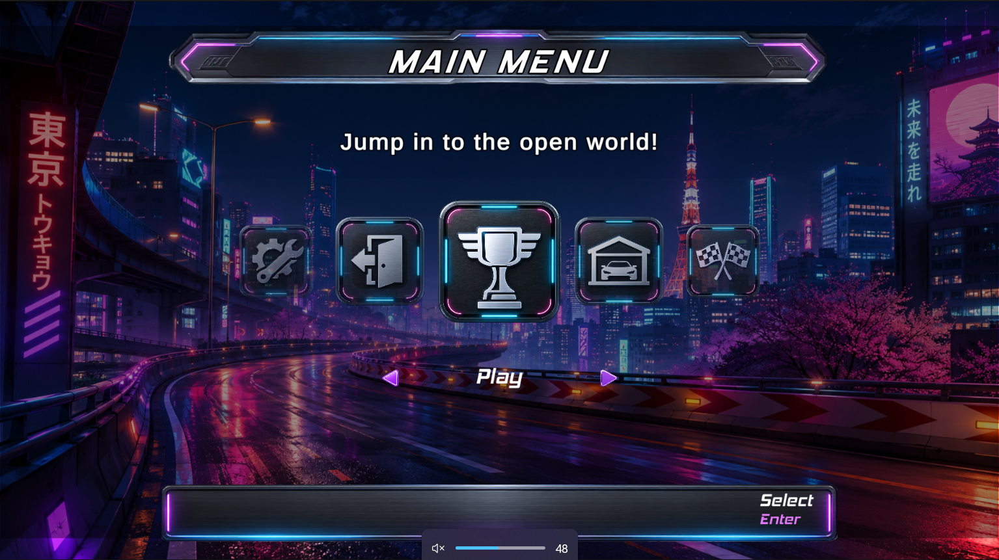

### Settings Menu

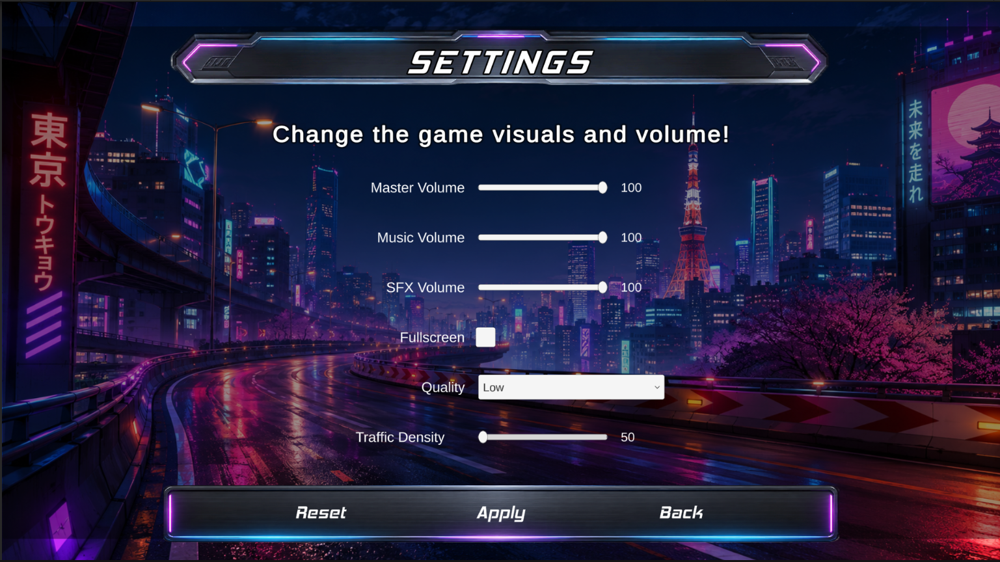

### Garage Vehicle Selection

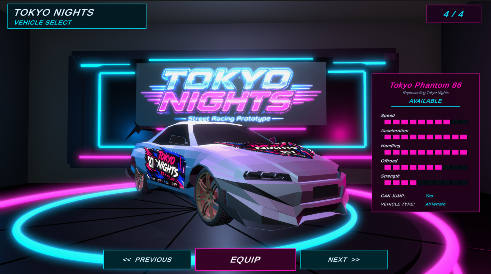

### Vehicle Roster

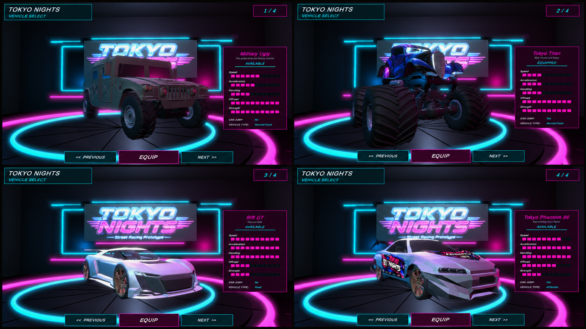

### Race Mode Launch

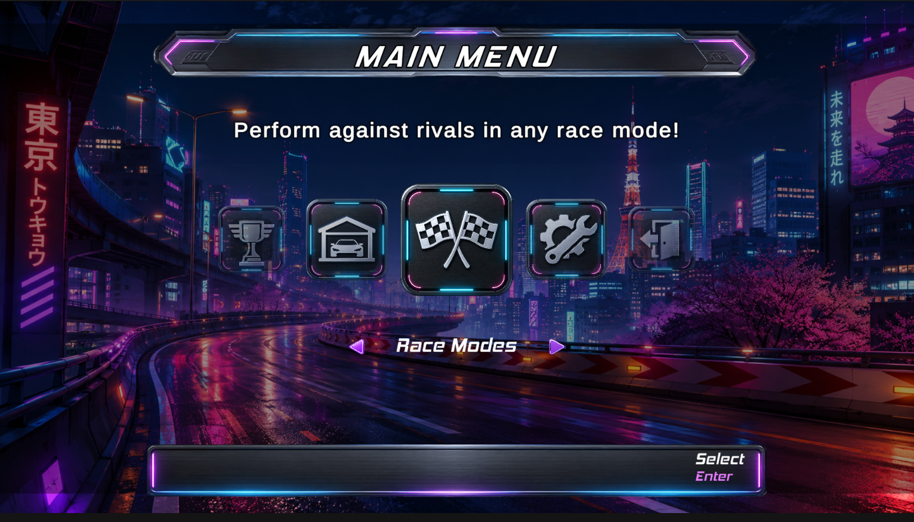

### Race Grid Start

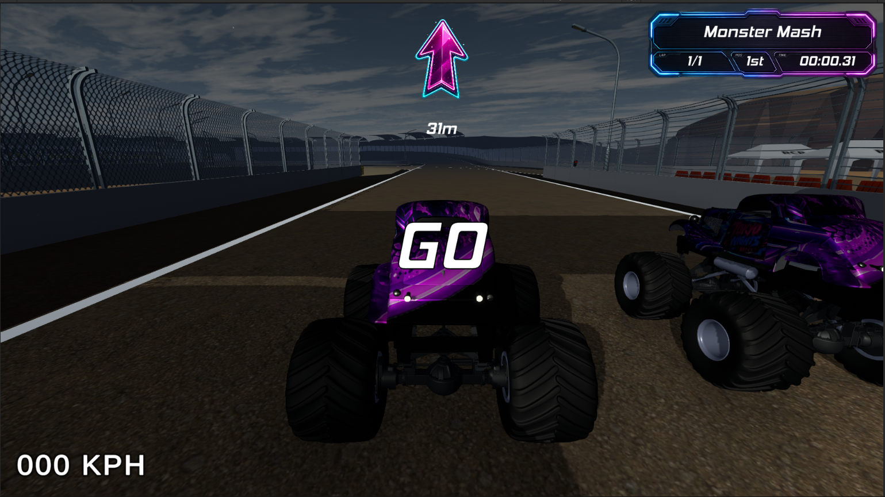

### Road Race

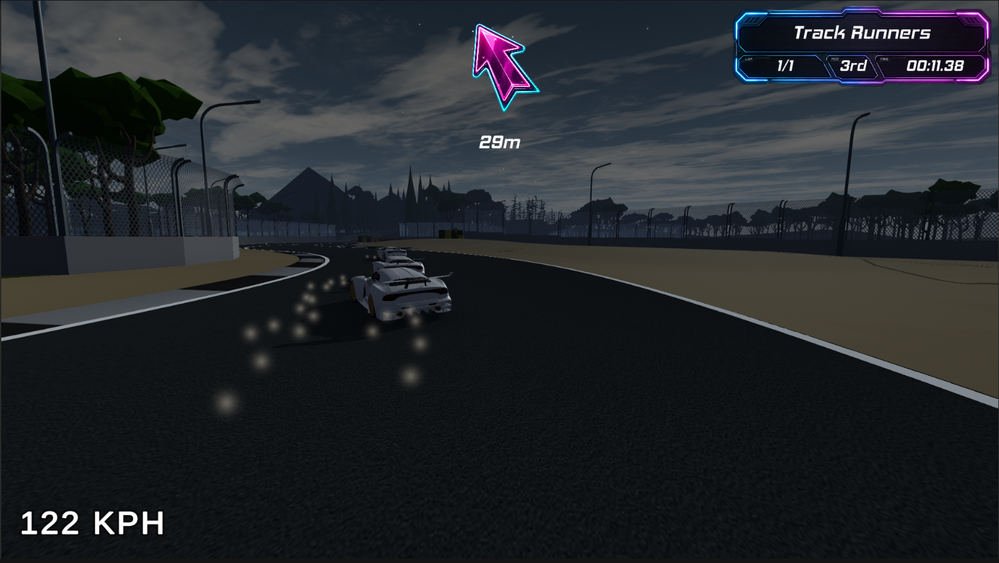

### Vehicle Class Racing

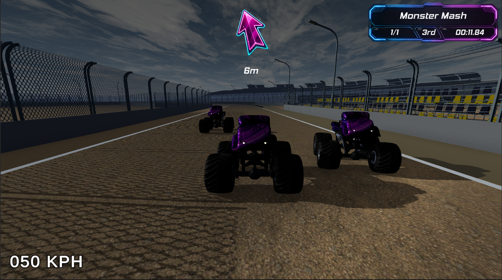

### Freeroam Traffic

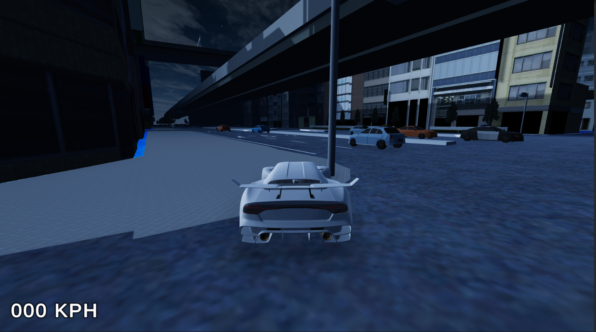

### Mission Marker Race Start

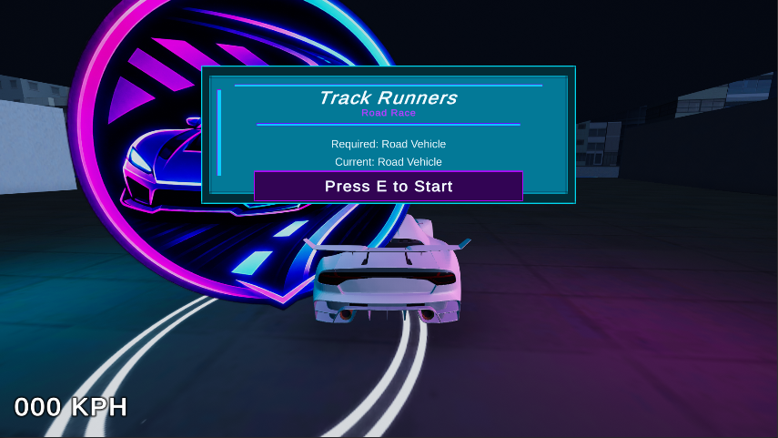

### Race Results

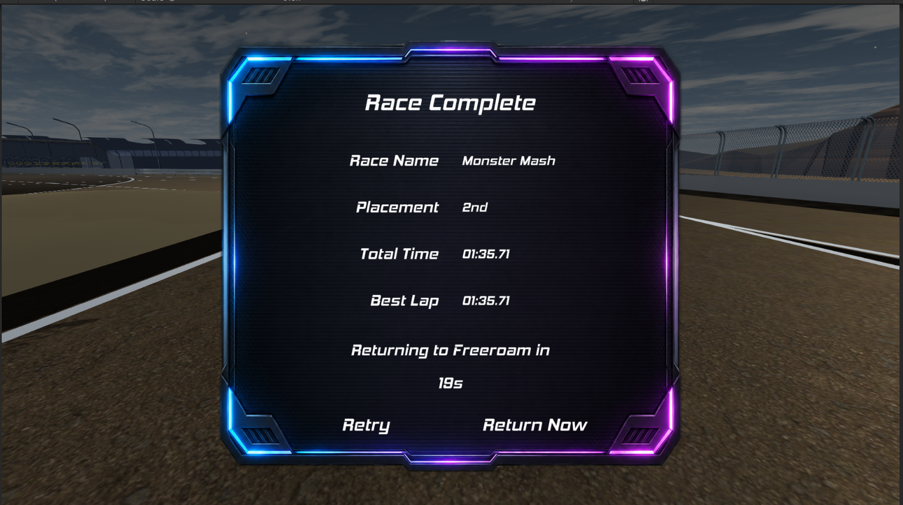

## Major Problems Solved

### Race Pathing vs Race Progress

One major architecture issue was keeping path-following/setup data separate from official race progress. Race progress needs a single source of truth so ranking and completion logic stay consistent.

The final approach separates the systems:

- Pathing/setup data is used for driving or route guidance.
- Checkpoints are used for official race progress.
- Racers are ranked using the same checkpoint-based `RacerProgress` system.

This keeps race position logic consistent even when extra route/helper points are used in the scene.

### Scene Return State Bugs

The project has multiple scene flows, including Garage returns, Race Modes returns, and Freeroam mission marker returns. Several bugs came from stale scene transition data.

The final flow:

- Clears temporary race data after main-menu race returns.
- Preserves freeroam marker return data only when returning to freeroam.
- Uses return-state requests so the main menu selects the correct carousel item.
- Prevents Garage return flow from being polluted by stale race data.

### Loading Screen Flow

RaceScene could return to MainMenuScene while leaving the loading overlay active. This was fixed by routing scene returns through the scene loading manager instead of manually showing the loading screen and loading scenes separately.

### Race Return Positioning

Race return positioning originally fought against the normal freeroam vehicle spawn point. The player could briefly return to the correct marker and then snap back to the default spawn point.

The final fix:

- `SelectedVehicleSpawner` ignores the normal PlayerSpawnPoint when returning from a race.
- `FreeroamReturnManager` places the player at the correct mission marker.
- A safe two-step placement routine prevents physics settling issues.

### Correct AI Vehicle Selection

Race Modes launched from the main menu originally needed stricter vehicle-type filtering. The fix was to filter race/vehicle setup by the current race’s required vehicle type.

Example:

- Road race → Road vehicle setup.
- OffRoad race → OffRoad vehicle setup.
- AllTerrain race → AllTerrain vehicle setup.
- MonsterTruck race → MonsterTruck vehicle setup.

## Systems Built

### Core Vehicle Gameplay

The vehicle system is built around arcade-style driving rather than simulation-level realism.

Implemented vehicle gameplay features include:

- Acceleration, steering, side grip, and speed control.
- Vehicle hop / jump input.
- Landing dust effects.
- Tyre smoke and surface effects.
- Engine audio and vehicle sound effects.
- Anti-stuck collider setup to reduce snagging on track edges.
- Ground checkpoint placement for consistent ground checks.
- Vehicle-specific camera tuning.
- Support for multiple vehicle classes.

Vehicle classes used by the project:

- Road
- OffRoad
- AllTerrain
- MonsterTruck

Each vehicle class can be used to control which races and AI opponents are available.

### Vehicle Database and Garage System

Vehicles are managed through a data-driven vehicle database.

The garage system supports:

- ScriptableObject `VehicleData` assets.
- A central `VehicleDatabase`.
- Separate gameplay, preview, and AI prefabs.
- Vehicle display names, descriptions, stats, and vehicle types.
- Garage preview spawning.
- Next / previous vehicle selection.
- Vehicle equip and save flow using PlayerPrefs.
- Return to main menu with the Garage menu item selected.

This allows new vehicles to be added without rewriting the garage or race launch code.

### Race Mode Database

Race modes are controlled through a ScriptableObject database.

The race mode system supports:

- `RaceModeDefinition` assets.
- `RaceModeDatabase`.
- Race ID.
- Race display name.
- Required vehicle type.
- Track variant.
- Race scene name.
- Return scene name.
- Optional AI count override.
- Main menu Race Modes launch flow.

The main menu Race Modes option selects a compatible race based on the currently equipped vehicle. For example, a road vehicle launches a road race, while a monster truck launches a monster truck race.

### Race System

The race system includes:

- Race definitions.
- Race IDs and display names.
- Vehicle type requirements.
- Track variants.
- Grid starts.
- AI count control.
- Checkpoint-based race progress.
- Lap counting.
- Race position tracking.
- Results screen.
- Retry race flow.
- Return-to-main-menu flow.
- Return-to-freeroam-marker flow.

The race scene is launched using race data passed through a static launch-data bridge. Once the race scene loads, the auto-start system finds the correct race definition, applies the requested track variant, prepares race vehicles, and starts the race.

### Checkpoint-Based Race Progress

Race progress is based on checkpoint gates.

Each racer has a `RacerProgress` component that tracks:

- Current lap.
- Completed laps.
- Last checkpoint index.
- Finish state.
- Finish order.
- Distance to next checkpoint.
- Segment progress.

The race position manager sorts racers using checkpoint/lap progress. This prevents AI waypoint count from corrupting race position.

### Race Setup and Route Support

The race scenes use checkpoint gates and setup data to keep race progress consistent.

Race setup features include:

- Vehicle-class-specific race setup.
- Grid start preparation.
- Checkpoint gate progress.
- Track variant selection.
- Race scene launch data.
- Race results and return flow.

A key architecture decision was separating route/helper data from official race progress:

- Helper/route points can support scene setup and driving flow.
- Checkpoint gates are used for race progress and ranking.
- Race position is based on checkpoint progress rather than unrelated helper transforms.

### Race Position System

The race position manager ranks racers using:

1. Finished state.
2. Finish order.
3. Completed laps.
4. Checkpoint progress.
5. Segment progress.
6. Distance to next checkpoint as a final tie-breaker.

This keeps race progress consistent even when helper route data has a different count from checkpoint gates.

### Freeroam and Mission Marker System

The project includes a freeroam scene with mission markers that can launch races.

Mission marker features include:

- Race ID.
- Race display name.
- Race scene name.
- Track variant.
- Return scene name.
- Return marker ID.
- Interaction prompt.
- Return-to-marker flow after race completion.

Freeroam marker races return the player to the correct marker after the race, while main-menu Race Modes races return to the main menu with Race Modes selected.

### Scene Flow and Return-State Handling

The project includes multiple scene flows:

- Main Menu → Garage → Main Menu.
- Main Menu → Race Modes → Race Scene → Results → Main Menu.
- Main Menu → Freeroam → Mission Marker Race → Race Scene → Results → Freeroam Marker.
- Garage → Freeroam return support.
- Race return state cleanup.

Several static state containers are used to bridge scene transitions:

- Race launch data.
- Race load request data.
- Main menu return state.
- Garage return data.

The final build includes cleanup logic to prevent stale race data from affecting later scene transitions.

### Loading Screen System

Scene transitions are handled with a loading screen controller and scene loader.

The project includes loading behavior for:

- Main menu to garage.
- Main menu to freeroam.
- Main menu to race scene.
- Race scene to main menu.
- Race scene to freeroam.
- Garage return flows.

This was important for preventing stuck loading overlays and making scene returns feel more polished.

### Freeroam Traffic System

The freeroam scene includes a traffic system built around nodes and a vehicle database.

Traffic system features include:

- Traffic node network.
- Spawn-only nodes.
- Initial population nodes.
- Runtime respawning.
- Traffic vehicle database.
- Weighted random / random / cycle prefab selection.
- Spawn blocking checks.
- Player avoidance around spawn points.
- City exit despawn support.
- Ground snapping for spawned vehicles.
- Traffic density setting.

The settings menu controls traffic density using these values:

- 50
- 100
- 150
- 200

Traffic density is saved and then read by the freeroam traffic spawner.

### Main Menu and UI Systems

The main menu uses a carousel-style UI.

Main menu features include:

- Carousel navigation.
- Menu item descriptions.
- Play / Garage / Race Modes / Settings / Exit options.
- Race Modes launcher integration.
- Title card switching.
- Return-state handling.
- Settings panel.
- Optional trophies/achievements panel support.

Return-state handling means the menu can automatically select the correct item after returning from another scene. For example:

- Returning from Garage selects Garage.
- Returning from a Race Modes race selects Race Modes.

### Settings System

The settings menu includes:

- Master volume.
- Music volume.
- SFX volume.
- Fullscreen toggle.
- Quality dropdown.
- Traffic density slider.

Settings are saved using PlayerPrefs.

The quality dropdown is populated from Unity quality settings. The project uses four quality levels:

- Low
- Medium
- High
- Ultra

High is intended as the normal gameplay default.

### Audio System

Audio is routed through Unity AudioMixer groups.

Audio features include:

- Master volume.
- Music volume.
- SFX volume.
- Persistent audio settings loader.
- Scene-to-scene audio setting persistence.
- Vehicle audio routed to SFX.
- Menu music routed to Music.

A custom editor tool was used to route vehicle AudioSources to the correct mixer group.

### Editor and Development Tools

Several editor/development tools and workflows were used to speed up setup and reduce repetitive manual work.

Included or documented tooling includes:

- Vehicle ground checkpoint aligner.
- Audio routing tool.
- Track variant manager tooling.
- Vehicle setup/onboarding workflow.
- Anti-stuck collider setup workflow.
- Race mode and vehicle database setup.
- Traffic node and vehicle setup workflow.

Some internal or experimental editor tools used during development are not included in this public repository if they are proprietary, messy, one-off, or intended for future standalone tool development.

## Architecture Highlights

### Data-Driven Vehicle and Race Setup

Vehicles and races are configured through ScriptableObjects, allowing gameplay behavior to be changed through data rather than hardcoded scene logic.

This made it easier to support:

- Multiple vehicle classes.
- Multiple race types.
- Vehicle-specific race filtering.
- AI vehicle filtering.
- Garage vehicle selection.
- Main menu race launching.

### Route Data vs Race Progress

A major bug fix involved separating route/helper data from official race progress.

The final architecture is:

- Helper route points = setup/driving support.
- Checkpoints = official race progress.
- RacePositionManager = ranks racers using checkpoint progress only.

This keeps race ranking stable even when the scene contains extra helper points.

### Scene Transition State Management

The project required multiple scene return flows. Static state containers are used carefully to pass temporary data across scene loads and then clear it after use.

Examples:

- Race launched from main menu returns to main menu.
- Race launched from freeroam returns to the matching mission marker.
- Garage returns to main menu with Garage selected.
- Stale race data is cleared after main-menu race returns.

### Public Portfolio Cleanup

The project was cleaned for public GitHub upload by:

- Removing private/proprietary scripts.
- Removing risky old copyrighted assets.
- Replacing vehicle assets with public-safe alternatives.
- Organizing scripts.
- Fixing missing script references.
- Verifying scene flows.
- Preparing screenshots and documentation.

## What I Learned

This project reinforced the importance of separating systems by responsibility. A major example was separating route/helper data from race checkpoint progress. Once checkpoints became the single source of truth for race progress, the race ranking system became much more reliable.

The project also involved debugging several scene-transition issues, which highlighted the importance of clearing temporary state after scene loads and keeping return-flow logic isolated.

Another key lesson was the value of editor tooling. Small tools for repetitive setup tasks, such as audio routing and ground checkpoint alignment, helped reduce manual errors and made the project easier to maintain.

## How to Run

1. Clone the repository.
2. Open the project in Unity 2022.3 LTS.
3. Open `MainMenuScene`.
4. Press Play.
5. Use the main menu to enter Garage, Freeroam, or Race Modes.

Recommended test flow:

1. Main Menu → Settings → Back.
2. Main Menu → Garage → Equip Vehicle → Main Menu.
3. Main Menu → Race Modes → Race → Results → Main Menu.
4. Main Menu → Freeroam → Mission Marker Race → Results → Return to Freeroam.

## Suggested Demo Flow

For a short gameplay demo video, the project can be shown in this order:

1. Main menu carousel.
2. Settings menu.
3. Garage vehicle selection.
4. Race Modes launch.
5. Race grid start.
6. Race gameplay on a curved track.
7. Results screen.
8. Return to main menu.
9. Freeroam traffic.
10. Mission marker race launch.

## Tech Stack

- Unity 2022.3 LTS
- C#
- TextMeshPro
- Unity AudioMixer
- ScriptableObjects
- Unity UI
- Rigidbody physics
- Custom editor scripts

## Project Status

This is a playable technical portfolio prototype.

Current status:

- Main menu flow works.
- Garage vehicle selection works.
- Race Modes launch works.
- RaceScene flow works.
- Race position/checkpoint tracking works.
- Results screen works.
- Main menu return flow works.
- Freeroam traffic works.
- Mission marker race launching works.
- Settings and audio persistence work.
- Quality settings are configured.
- Vehicles have been replaced with public-safe assets.

## Known Limitations

This project is a portfolio prototype, not a finished commercial racing game.

Known limitations and future polish areas include:

- Vehicle scale and art direction could be normalized further.
- Vehicle physics could be tuned further per vehicle class.
- Traffic behavior could be expanded with intersections and more advanced rules.
- UI visuals could receive more final-art polish.
- More race types and track layouts could be added.
- More detailed progression/unlock systems could be added.

## Future Improvements

Possible future improvements:

- Add more race types.
- Add career/progression structure.
- Add vehicle unlocks.
- Add more traffic behaviors.
- Add race rewards.
- Add persistent player profile data.
- Add more polished vehicle presentation.
- Add controller support.
- Add a build/release download.
- Expand editor tools into reusable Unity packages.

## Third-Party Assets

This project uses third-party Unity packages and assets. Source code written by the author is licensed separately from third-party assets. See [THIRD_PARTY_NOTICES.md](THIRD_PARTY_NOTICES.md) for asset/package notes.

## Repository Notes

This repository is intended as a public portfolio proof-of-work.

Some development tools, experiments, private/proprietary files, large source art files, and non-critical visual/environment assets may have been excluded or reduced in size to keep the public repository manageable.

The included project focuses on the playable systems, public-safe code/assets, scripts, scenes, prefabs, documentation, screenshots, and demo video.

The YouTube demo video shows the intended gameplay flow and visual presentation of the project.

## Author

Built by Codie Shannon.

GitHub: [Codie-Shannon](https://github.com/Codie-Shannon)

## License

This repository is provided as a portfolio project.

Source code written by the author is available under the MIT License unless otherwise stated.

Third-party assets, models, textures, audio, and packages remain under their original licenses. Check individual asset sources/licenses before reuse.
